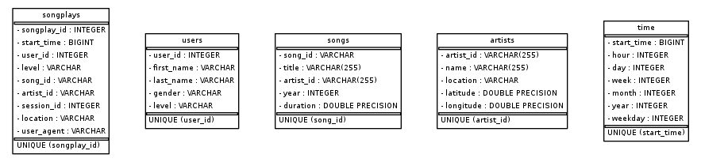

# Project description
The goal of this project is to extract the necessary information from song_files and log_files to create a star-schema-like songplay database for Sparkify.

# Database design
The database created consists of five tables:

* songplays as the ***fact table***
* users, songs, artists and time as ***dimension tables*** that are connected

# Instructions for how to run the Python Code
To run the python code, 

* run "python create_tables.py" as a shell command or in the etl.ipynb (for some reason, I was not able to run it directly from test.ipynb)
* in "test.ipynb", use the provided queries to check if inserting the data was successful.

# Project Repository files
***In the folder "data"***, the "song_data" files are used to fill the songs and artist tables while the "log_data" files are used to fill extract data for the user, time and songplays tables.

The ***Jupyter notebooks (.ipynb)*** are used to test the etl steps (etl.ipynb) and to test, if the etl process did yield the demanded results (test.ipynb).

The ***Python scripts (.py)*** are used to:

* create the necessary tables described in section "Database design" (create_tables.py)
* hold the SQL statements necessary to insert the data from the data sources into the database tables (sql_queries.py)
* run the ETL process and insert the transformed data into the database tables (etl.py)
* create an image of the database schema (er_diagram.py) that is used in the README.md